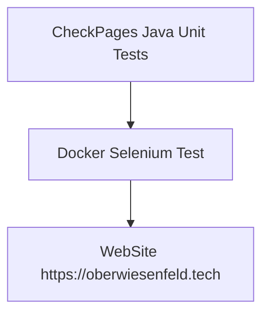

# CheckPages [](https://github.com/oberwiesenfeld/checkpages-oberwiesenfeld-tech/actions/workflows/seleniumTest.yml)

A simple selenium test project which interacts with two docker containers: 

* a headless chrome in a selenium server.
* a maven java junit project which runs selenium tests

## JUnit 5 Selenium Tests 

The java unit test files are running some tests against the webpage https://oberwiesenfeld.tech



## Log of a sample test run

docker-compose build
selenium uses an image, skipping
Building checkpages
Step 1/4 : FROM maven:3.6.0-jdk-8-slim
27833a3ba0a5: Pull complete
16d944e3d00d: Pull complete
9019de9fce5f: Pull complete
9b053055f644: Pull complete
1c80aca6b8ec: Pull complete
a63811f09e7c: Pull complete
f88ce8d36c86: Pull complete
a603a4761981: Pull complete
f315d92acca3: Pull complete
Digest: sha256:8aba145d88d61eaef0492b3a9c8026f8c3102f698de6d8242143ae147205095a
Status: Downloaded newer image for maven:3.6.0-jdk-8-slim
 ---> c203892a8124
Step 2/4 : COPY src /usr/src/app/src
 ---> 9a99e7f253a0
Step 3/4 : COPY pom.xml /usr/src/app
 ---> 58fda66b4b47
Step 4/4 : CMD mvn -f /usr/src/app/pom.xml clean test
 ---> Running in 20a68f76679f
Removing intermediate container 20a68f76679f
 ---> 10dfdf74b84f
Successfully built 10dfdf74b84f
Successfully tagged checkpages:0.0.1
$ docker-compose up
Creating network "checkpages-oberwiesenfeld-tech_default" with the default driver
Pulling selenium (selenium/standalone-chrome:3.141.59)...
3.141.59: Pulling from selenium/standalone-chrome
84ed7d2f608f: Pulling fs layer
be2bf1c4a48d: Pulling fs layer
a5bdc6303093: Pulling fs layer
e9055237d68d: Pulling fs layer
76e7b4e61e87: Pulling fs layer
27cf1d3069d8: Pulling fs layer
1c2fe0a8f283: Pulling fs layer
d9a1521cc7f0: Pulling fs layer
3c3e129bf626: Pulling fs layer
f36c4b7eea7b: Pulling fs layer
c310191eb1d8: Pulling fs layer
394331f036a8: Pulling fs layer
06dda771b3f7: Pull complete
cbf1b8c85d9f: Pull complete
cec3eb2a749c: Pull complete
46e6e0906f1c: Pull complete
01ad13ece1dd: Pull complete
8b205f9c98b5: Pull complete
af9b2d1e8b26: Pull complete
d3a23b88cf54: Pull complete
958c2786bed2: Pull complete
fe1bd064724f: Pull complete
0f31bdf96057: Pull complete
fb915b738539: Pull complete
1bf917ec24b2: Pull complete
68ed84c65bf9: Pull complete
9ada53a3a2cc: Pull complete
Creating checkpages-oberwiesenfeld-tech_selenium_1 ... done
Creating checkpages-oberwiesenfeld-tech_checkpages_1 ... done
Attaching to checkpages-oberwiesenfeld-tech_selenium_1, checkpages-oberwiesenfeld-tech_checkpages_1
selenium_1    | 2019-04-28 16:51:20,145 INFO Included extra file "/etc/supervisor/conf.d/selenium.conf" during parsing
selenium_1    | 2019-04-28 16:51:20,146 INFO supervisord started with pid 8
selenium_1    | 2019-04-28 16:51:21,151 INFO spawned: 'xvfb' with pid 11
selenium_1    | 2019-04-28 16:51:21,153 INFO spawned: 'selenium-standalone' with pid 12
selenium_1    | 16:51:21.570 INFO [GridLauncherV3.parse] - Selenium server version: 3.141.59, revision: e82be7d358
selenium_1    | 2019-04-28 16:51:21,573 INFO success: xvfb entered RUNNING state, process has stayed up for > than 0 seconds (startsecs)
selenium_1    | 2019-04-28 16:51:21,573 INFO success: selenium-standalone entered RUNNING state, process has stayed up for > than 0 seconds (startsecs)
selenium_1    | 16:51:21.744 INFO [GridLauncherV3.lambda$buildLaunchers$3] - Launching a standalone Selenium Server on port 4444
selenium_1    | 2019-04-28 16:51:21.833:INFO::main: Logging initialized @668ms to org.seleniumhq.jetty9.util.log.StdErrLog
selenium_1    | 16:51:22.294 INFO [WebDriverServlet.<init>] - Initialising WebDriverServlet
selenium_1    | 16:51:22.448 INFO [SeleniumServer.boot] - Selenium Server is up and running on port 4444
checkpages_1  | [INFO] Scanning for projects...
checkpages_1  | [INFO] 
checkpages_1  | [INFO] -------------< tech.oberwiesenfeld.checkpages:checkpages >--------------
checkpages_1  | [INFO] Building checkpages 1.0-SNAPSHOT
checkpages_1  | [INFO] --------------------------------[ jar ]---------------------------------
checkpages_1  | [INFO] 
checkpages_1  | [INFO] --- maven-clean-plugin:2.5:clean (default-clean) @ checkpages ---
checkpages_1  | [INFO] 
checkpages_1  | [INFO] --- maven-resources-plugin:2.6:resources (default-resources) @ checkpages ---
checkpages_1  | [INFO] Using 'UTF-8' encoding to copy filtered resources.
checkpages_1  | [INFO] skip non existing resourceDirectory /usr/src/app/src/main/resources
checkpages_1  | [INFO] 
checkpages_1  | [INFO] --- maven-compiler-plugin:3.7.0:compile (default-compile) @ checkpages ---
checkpages_1  | [INFO] Changes detected - recompiling the module!
checkpages_1  | [INFO] Compiling 1 source file to /usr/src/app/target/classes
checkpages_1  | [INFO] 
checkpages_1  | [INFO] --- maven-resources-plugin:2.6:testResources (default-testResources) @ checkpages ---
checkpages_1  | [INFO] Using 'UTF-8' encoding to copy filtered resources.
checkpages_1  | [INFO] skip non existing resourceDirectory /usr/src/app/src/test/resources
checkpages_1  | [INFO] 
checkpages_1  | [INFO] --- maven-compiler-plugin:3.7.0:testCompile (default-testCompile) @ checkpages ---
checkpages_1  | [INFO] Changes detected - recompiling the module!
checkpages_1  | [INFO] Compiling 3 source files to /usr/src/app/target/test-classes
checkpages_1  | [INFO] 
checkpages_1  | [INFO] --- maven-surefire-plugin:2.22.1:test (default-test) @ checkpages ---
checkpages_1  | [INFO] 
checkpages_1  | [INFO] -------------------------------------------------------
checkpages_1  | [INFO]  T E S T S
checkpages_1  | [INFO] -------------------------------------------------------
checkpages_1  | [INFO] Running tech.oberwiesenfeld.checkpages.CheckPagesReitwagenTest
checkpages_1  | Connecting to Selenium Server: http://selenium:4444/wd/hub
selenium_1    | 16:51:33.318 INFO [ActiveSessionFactory.apply] - Capabilities are: {
selenium_1    |   "browserName": "chrome",
selenium_1    |   "goog:chromeOptions": {
selenium_1    |     "args": [
selenium_1    |       "--ignore-certificate-errors"
selenium_1    |     ],
selenium_1    |     "extensions": [
selenium_1    |     ]
selenium_1    |   }
selenium_1    | }
selenium_1    | 16:51:33.321 INFO [ActiveSessionFactory.lambda$apply$11] - Matched factory org.openqa.selenium.grid.session.remote.ServicedSession$Factory (provider: org.openqa.selenium.chrome.ChromeDriverService)
selenium_1    | Starting ChromeDriver 74.0.3729.6 (255758eccf3d244491b8a1317aa76e1ce10d57e9-refs/branch-heads/3729@{#29}) on port 28189
selenium_1    | Only l[1556470293.358][SEVERE]: bind() failed: Cannot assign requested address (99)
selenium_1    | ocal connections are allowed.
selenium_1    | Please protect ports used by ChromeDriver and related test frameworks to prevent access by malicious code.
selenium_1    | 16:51:34.314 INFO [ProtocolHandshake.createSession] - Detected dialect: OSS
selenium_1    | 16:51:34.820 INFO [RemoteSession$Factory.lambda$performHandshake$0] - Started new session 587d59060e0a21e30be69e2bbba8f154 (org.openqa.selenium.chrome.ChromeDriverService)
checkpages_1  | Apr 28, 2019 4:51:34 PM org.openqa.selenium.remote.ProtocolHandshake createSession
checkpages_1  | INFO: Detected dialect: OSS
checkpages_1  | screenshot has been saved to /tmp/screen_suche_reitwagen_2019_04_28_16_51_45.png
checkpages_1  | [[RemoteWebDriver: chrome on LINUX (587d59060e0a21e30be69e2bbba8f154)] -> link text: Der Daimler Reitwagen]
checkpages_1  | screenshot has been saved to /tmp/screen_click_artikel_2019_04_28_16_51_51.png
selenium_1    | 16:51:53.359 INFO [ActiveSessions$1.onStop] - Removing session 587d59060e0a21e30be69e2bbba8f154 (org.openqa.selenium.chrome.ChromeDriverService)
selenium_1    | 16:51:53.390 INFO [ActiveSessionFactory.apply] - Capabilities are: {
selenium_1    |   "browserName": "chrome",
selenium_1    |   "goog:chromeOptions": {
selenium_1    |     "args": [
selenium_1    |       "--ignore-certificate-errors"
selenium_1    |     ],
selenium_1    |     "extensions": [
selenium_1    |     ]
selenium_1    |   }
selenium_1    | }
selenium_1    | 16:51:53.390 INFO [ActiveSessionFactory.lambda$apply$11] - Matched factory org.openqa.selenium.grid.session.remote.ServicedSession$Factory (provider: org.openqa.selenium.chrome.ChromeDriverService)
checkpages_1  | [INFO] Tests run: 2, Failures: 0, Errors: 0, Skipped: 0, Time elapsed: 21.202 s - in tech.oberwiesenfeld.checkpages.CheckPagesReitwagenTest
checkpages_1  | [INFO] Running tech.oberwiesenfeld.checkpages.CheckPagesOberwiesenfeldTest
checkpages_1  | Connecting to Selenium Server: http://selenium:4444/wd/hub
selenium_1    | Starting ChromeDriver 74.0.3729.6 (255758eccf3d244491b8a1317aa76e1ce10d57e9-refs/branch-heads/3729@{#29}) on port 8562
selenium_1    | Only local connections are allowed.
selenium_1    | Please protect ports used by ChromeDriver and related test frameworks to prevent access by malicious code.
selenium_1    | [1556470313.412][SEVERE]: bind() failed: Cannot assign requested address (99)
selenium_1    | 16:51:53.902 INFO [ProtocolHandshake.createSession] - Detected dialect: OSS
selenium_1    | 16:51:53.943 INFO [RemoteSession$Factory.lambda$performHandshake$0] - Started new session aae0a7507af61bda5215bed88e089b28 (org.openqa.selenium.chrome.ChromeDriverService)
checkpages_1  | Apr 28, 2019 4:51:53 PM org.openqa.selenium.remote.ProtocolHandshake createSession
checkpages_1  | INFO: Detected dialect: OSS
checkpages_1  | screenshot has been saved to /tmp/screen_suche_m2b15_2019_04_28_16_52_06.png
checkpages_1  | [[RemoteWebDriver: chrome on LINUX (aae0a7507af61bda5215bed88e089b28)] -> link text: In München am Oberwiesenfeld]
checkpages_1  | screenshot has been saved to /tmp/screen_click_artikel_2019_04_28_16_52_11.png
selenium_1    | 16:52:13.992 INFO [ActiveSessions$1.onStop] - Removing session aae0a7507af61bda5215bed88e089b28 (org.openqa.selenium.chrome.ChromeDriverService)
checkpages_1  | [INFO] Tests run: 2, Failures: 0, Errors: 0, Skipped: 0, Time elapsed: 20.593 s - in tech.oberwiesenfeld.checkpages.CheckPagesOberwiesenfeldTest
checkpages_1  | [INFO] 
checkpages_1  | [INFO] Results:
checkpages_1  | [INFO] 
checkpages_1  | [INFO] Tests run: 4, Failures: 0, Errors: 0, Skipped: 0
checkpages_1  | [INFO] 
checkpages_1  | [INFO] ------------------------------------------------------------------------
checkpages_1  | [INFO] BUILD SUCCESS
checkpages_1  | [INFO] ------------------------------------------------------------------------
checkpages_1  | [INFO] Total time:  51.702 s
checkpages_1  | [INFO] Finished at: 2019-04-28T16:52:14Z
checkpages_1  | [INFO] ------------------------------------------------------------------------
checkpages-oberwiesenfeld-tech_checkpages_1 exited with code 0
``` 
